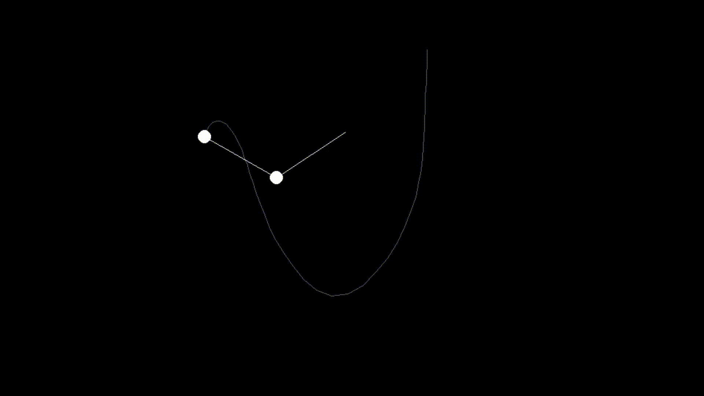

# Double pendulum
This is a very rudimentary double pendulum simulation. I quite enjoy physics, so this was more so an interesting simple project I worked on. I had ambitions to make a triple pendulum simulation, however after finding the angular acceleration of a two pendulum simulation, I was not too keen on re-doing it with a three pendulum system. 

## Example
This is the simulation with drag enabled. 

