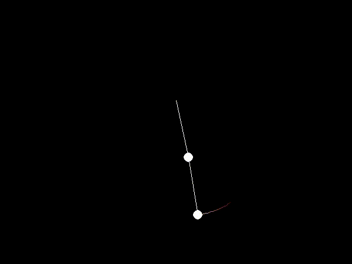

# N-Pendulum
This is an n-pendulum system solver that makes use of sympy, a symbolic mathematics library. We build up several Lagrangian equations based on the amount of lengths and masses provided for the pendulum, then make use of sympy to solve each Lagrangian as a python method for the acceleration of each angle. These equations allow us to visualize the pendulum system. Examples provided below. 

This project was done to better understand Lagrangian methods. I intended to allow for more than a 3 pendulum system generated to be reasonable eventually by using automatic or numerical differentiation methods, as opposed to symbolic.

## Examples

Single pendulum.

Double pendulum.

Triple pendulum.

